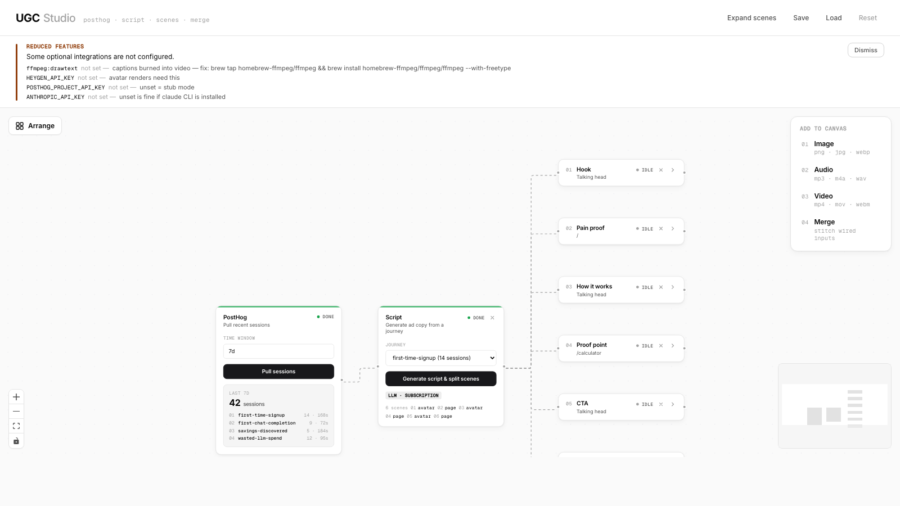
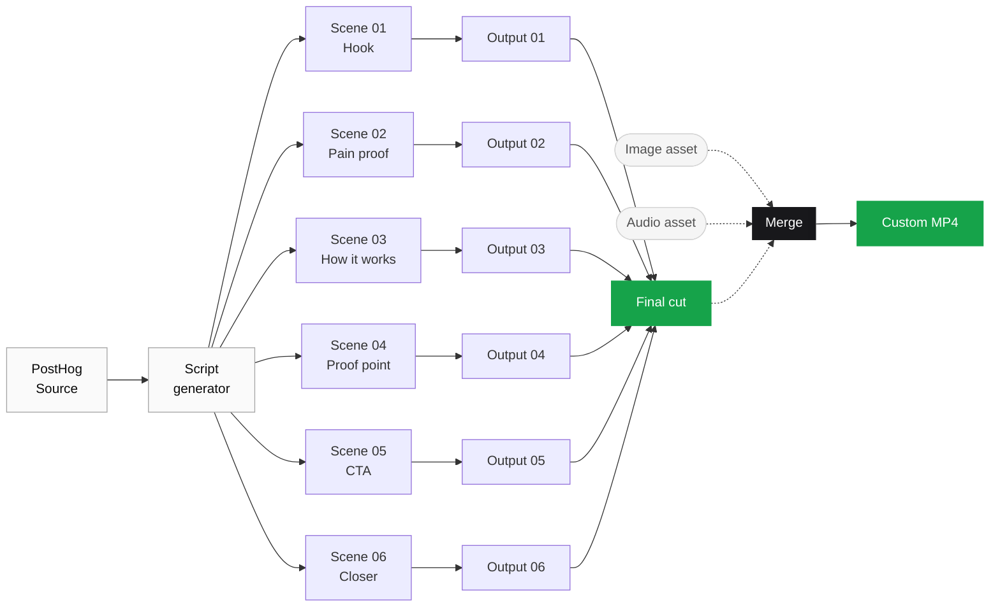
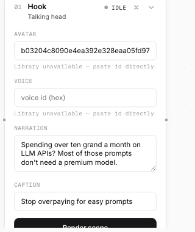
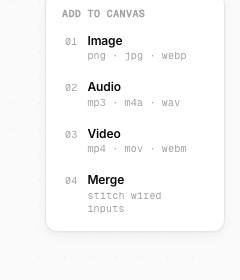
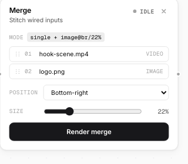
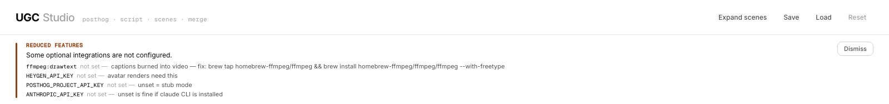

# UGC Studio

[](https://github.com/doramirdor/ugc-studio/actions/workflows/ci.yml)
[](LICENSE)
[](.nvmrc)

Visual node-graph editor that turns PostHog session data into stitched MP4 ads. Pull sessions, generate a script, split into scenes, render each one with a HeyGen avatar or a browser screen-recording, then concat into a final video — every step on a canvas you can drag, edit, and prune.



> **Just want to see the canvas?** `npm install && npm run dev`. With no environment variables set, `/api/posthog` returns canned journeys and `/api/script` falls back to a hardcoded template — the UI is fully usable without any keys. The HealthBanner at the top of the canvas tells you exactly what to install or configure to unlock the LLM, HeyGen, and recorder paths.

## Quick start with Claude Code

If you're running [Claude Code](https://claude.com/claude-code), the project ships with slash commands that pilot the install for you:

```bash
git clone https://github.com/doramirdor/ugc-studio.git
cd ugc-studio
claude            # opens Claude Code in this directory
```

Then in the Claude Code prompt:

| Command | What it does |
|---|---|
| `/setup` | Guided onboarding — probes binaries, asks before installing missing pieces, optionally clones the recorder repo, walks you through env vars, verifies via `/api/health`, hands off to `npm run dev`. |
| `/doctor` | Read-only diagnostic. Re-runs every check the HealthBanner does and tells you what's wrong. Makes no changes. |
| `/dev` | Boots the dev servers (Vite + Express) and confirms they're up. |
| `/install-ffmpeg` | Specifically fixes the **drawtext-missing** gotcha by installing the `homebrew-ffmpeg/ffmpeg` tap version. Captions won't burn into renders without this. |
| `/screenshot` | Helps you stage and capture the canvas screenshots referenced in this README. |

The commands live under [`.claude/commands/`](.claude/commands/) — read them, edit them, or override them locally at `~/.claude/commands/`.

## How it works



Solid arrows are auto-spawned by the pipeline (Source → Script success → Scenes; Scenes done → Outputs; all Outputs → Final cut). Dotted arrows are manual — drag from the palette to add image/audio/video assets and a Merge node, then wire whatever combination you want into a custom MP4.

## What you get

### Numbered scene cards, collapsed by default

Six scenes don't drown the canvas — each spawns compact, status-rail-only. Click the chevron to expand, edit narration / avatar / voice / caption, click Render, click chevron again to collapse. A **Collapse / Expand scenes** toggle in the header flips all of them at once.



### Drag-and-drop palette

Top-right of the canvas. Drag onto any spot and a node appears at the drop coords, ready to upload or wire.



### Merge node — concat, image overlay, audio replace/mix

Wire any combination of scene outputs, uploaded videos, image overlays, and audio. Drag list items inside the merge to reorder. Position presets (top-left / top-right / bottom-left / bottom-right / center) and a 10–60% scale slider for image overlays. `replace` vs `mix` toggle for audio.



### HealthBanner that tells you exactly what's wrong

Probes ffmpeg, ffprobe, python3, heygen, claude, the `drawtext` filter, the recorder dir, and every relevant env var. Surfaces failures with the install command needed to fix them.



## Stack

- **React 18 + Vite + TypeScript** for the canvas
- **[@xyflow/react](https://reactflow.dev)** for the node graph (manual connect, drag-drop, isValidConnection)
- **Framer Motion** for status pulses and node spawn animations
- **Zustand** for graph state (with persist + cascade-delete tombstones)
- **Express** backend that wraps the [posthog-demo-recorder](https://github.com/heygen-com/skills) recorder + the `heygen` CLI

## Prerequisites

If you're not using `/setup`, the manual setup is:

1. **The recorder repo cloned.** Default location `~/Documents/code/Nadir/getnadir.dev/marketing/demo-recorder`; override with `RECORDER_DIR=/path`. Without it, avatar beats still render but page (browser-recording) beats fail.
2. **`ffmpeg` and `ffprobe` on your PATH.** For burned-in captions, ffmpeg must include the `drawtext` filter (libfreetype). Homebrew's default formula omits it; if `/api/health` reports `ffmpeg:drawtext` failing, install the `homebrew-ffmpeg` tap version:
   ```bash
   brew tap homebrew-ffmpeg/ffmpeg
   brew install homebrew-ffmpeg/ffmpeg/ffmpeg --with-freetype
   ```
   Without drawtext, renders still succeed but ship without captions and the UI shows an advisory banner.
3. **HeyGen CLI** (optional but recommended for avatar renders):
   ```bash
   curl -fsSL https://static.heygen.ai/cli/install.sh | bash
   echo "$HEYGEN_API_KEY" | heygen auth login
   ```
4. **The recorder's `.env`** — `HEYGEN_API_KEY`, `HEYGEN_VOICE_ID`, `DEMO_BASE_URL` at minimum. Optional: `POSTHOG_PROJECT_API_KEY` (without it, source returns canned journeys).
5. **LLM script generation** works out of the box if you have the [Claude Code](https://claude.com/claude-code) CLI installed and logged in — the server shells out to `claude -p` and uses your existing subscription. No API key needed. If you'd rather use a direct API key, set `ANTHROPIC_API_KEY` and that path takes priority. Customize the script's grounding via `PRODUCT_PACK_PATH` pointing at a markdown product pack. Without either, `/api/script` falls back to a hardcoded 6-beat template.

## Script generation modes

In preference order:

1. **`ANTHROPIC_API_KEY` set** → direct API call to Claude Sonnet 4.6 with structured tool-use (fastest).
2. **`claude` CLI on PATH** → invoked via `claude -p --max-turns 1 --disallowedTools '*'`. Uses your Claude Code subscription. ~10s per script.
3. **Neither** → hardcoded 6-beat template (always works, generic copy).

The Script node in the UI badges which mode produced the current script (`LLM · claude-sonnet-4-6` / `LLM · subscription` / `TEMPLATE`).

## Run

```bash
npm install
npm run dev
```

Boots:
- **Vite** on http://localhost:5173 — the UI canvas
- **Express** on http://localhost:8787 — the backend

Vite proxies `/api/*` and `/videos/*` to Express. The HealthBanner inside the canvas tells you what's working and what's missing.

## Environment variables

| var | effect |
|---|---|
| `RECORDER_DIR` | path to `posthog-demo-recorder` (default: `~/Documents/code/Nadir/...`) |
| `PORT` | Express port (default `8787`) |
| `ANTHROPIC_API_KEY` | optional — if set, direct API instead of `claude` CLI |
| `ANTHROPIC_MODEL` | override the API-path model (default `claude-sonnet-4-6`) |
| `UGC_USE_CLAUDE_CLI` | set to `false` to disable the CLI fallback |
| `PRODUCT_PACK_PATH` | path to markdown product pack used as system prompt grounding |
| `POSTHOG_PROJECT_API_KEY` | unset → `/api/posthog` runs in stub mode |
| `HEYGEN_API_KEY` | required for avatar renders and page-beat narration |
| `HEYGEN_VOICE_ID` | default voice id (overridable per-beat) |
| `UGC_AUTH_TOKEN` | if set, all `/api/*` and `/videos/*` require `Authorization: Bearer <token>` |

## Features

- ✅ Auto-spawning pipeline: Source → Script → Scenes → Outputs → Final cut
- ✅ LLM script generation (Claude Sonnet 4.6 via API or subscription, template fallback)
- ✅ HeyGen avatar + voice pickers per scene (browseable library, free-text fallback)
- ✅ Content-addressed render cache (SHA-256 of beat content; re-renders are free)
- ✅ Burned-in captions via ffmpeg drawtext (gracefully skipped if filter unavailable)
- ✅ Drag-and-drop palette: image / audio / video assets + Merge nodes
- ✅ Merge pipeline: concat + image overlay (5 positions, 10–60% scale) + audio replace/mix, drag-to-reorder
- ✅ Cascade-delete with orphan-pruning — delete a scene and only its dependent leaves go with it
- ✅ Connection validation — manual edges only land on Merge nodes (no nonsensical wiring)
- ✅ Collapse / expand all scenes from the header
- ✅ Project Save / Load as portable JSON
- ✅ Real `/api/health` preflight + dismissible HealthBanner
- ✅ Optional bearer-token auth (`UGC_AUTH_TOKEN`)
- ✅ Auto-retry on transient recorder failures with live stderr streaming

## Roadmap

- ⏳ Hosted multi-tenant deployment (Postgres + worker queue + Docker)
- ⏳ Eval harness for the script LLM (lint → judge → human triage)
- ⏳ A/B branching of beats
- ⏳ Time-windowed image overlays in Merge
- ⏳ Picture-in-picture and side-by-side merge modes

## Contributing

See [CONTRIBUTING.md](CONTRIBUTING.md). The bar: does it remove a sharp edge for the next contributor, or make the demo path better?

## License

[MIT](LICENSE) © Dor Amir and UGC Studio contributors.
